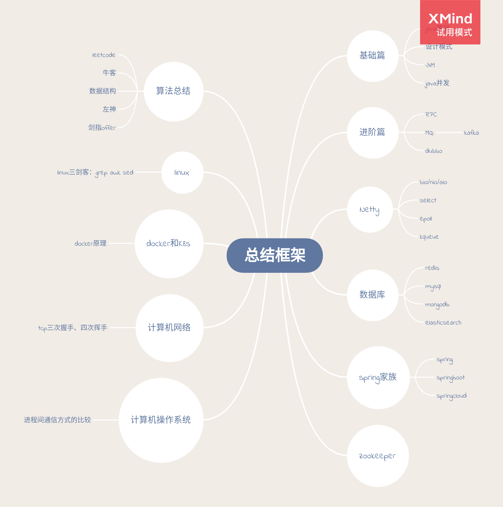

# Doraemon
Everyone needs a place for Recording! 

## Logs
2020-12-08 新建空仓库 By Lcr

2020-12-12 By Lcr
1. 新增nav标签
2. 新增图片缩放js
3. 新增代码可以复制到剪贴站的功能
4. 新增字数统计的功能
5. 新增代码高亮

2020-12-13

new Member: Hy

images文件夹用来存放md文件里面的图片 by Lcr

新建算法总结文件夹，为了占位，创建了TODO.md by Lcr

新建目录的示例可以查看_siderbar.md文件 by Lcr

2020-12-14

打印两个有序链表的公共部分 By Lcr

最长公共子序列的长度 TO BE CONTINUED By Lcr

## TODO
> 怕忘记的内容可以写在TODO这里，如果完成了就在前面加上[x]，否则加上[ ]

1. [x] 解决图片展示的问题 本地生成base64还是使用图床？-> 先上传到github再使用github的图片链接
2. [x] 侧边栏层级布置：请查看关于安装与使用的示例图片
3. [x] 总结的内容框架脑图：初步整理了，后续可以继续修改更新如下

4. [ ] @Hy 加油总结 冲冲冲